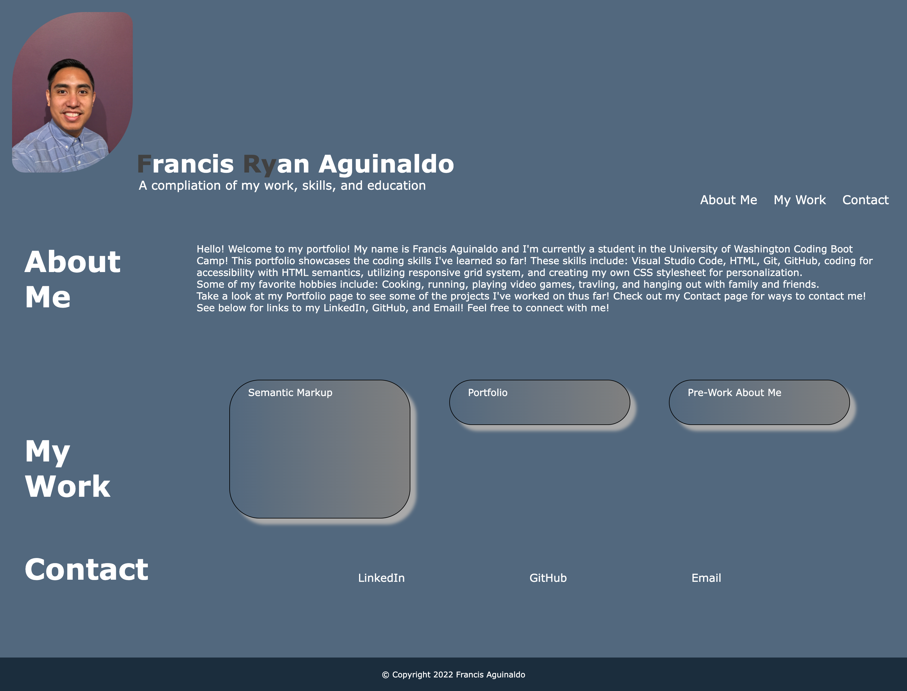

# Portfolio

## Table of Contents

- [Description](#description)
- [GitHub Repository and Page](#GitHub-Repository-and-Page)
- [Technologies](#technologies)
- [Installation](#installation)
- [Usage](#usage)
- [Screenshot](#screenshot)
- [Credits](#credits)

## Description

I was given the tast to create my very oen portfolio using advanced CSS. This is intended not only as homework, but as a way to showcase the work I have done and the skills that I've learned thoughtout this course.

By using skills such as media query; Flexbox, and box styling, I am able to style my portfolio to best present my work.

## GitHub Repository and Page

- [GitHub Repository](https://github.com/nayrsicnarf/portfolio.git)

- [GitHub Page](https://nayrsicnarf.github.io/portfolio/)

## Technologies

- [HTML](https://www.w3schools.com/html/default.asp)
- [CSS](https://www.w3schools.com/css/default.asp)

## Installation

To view this webpage on a local machine, pull the code from [GitHub](https://github.com/nayrsicnarf/Semantic_Markup_HW1.git) using Terminal (Mac) or Git (Windows) and use the following (or similar) programs:

- Operating System: macOS Monterey Version 21.1
- Visual Studio Code: Version 1.64.2
- Google Chrome: Version 98.0.4758.102
- Terminal: Version 2.12

## Usage

To view the completed project, visit my [GitHub Page](https://github.com/nayrsicnarf/portfolio.git) or refer to the [Installation](#installation) section of this README.

## Screenshot

## Credits

This was the second homework assignment as part of the [University of Washington Coding Boot Camp](https://bootcamp.uw.edu/coding/). Some of the information used to complete this project was provided by the instructors of this Boot Camp. But other information were obtained, but not limited to, through the following resources:

- [Google](https://www.google.com/)
- [W3Schools Online Web Tutorials](https://www.w3schools.com/)
- [A Complete Guide to Flexbox](https://css-tricks.com/snippets/css/a-guide-to-flexbox/)
- [Flexbox Froggy](https://flexboxfroggy.com/)